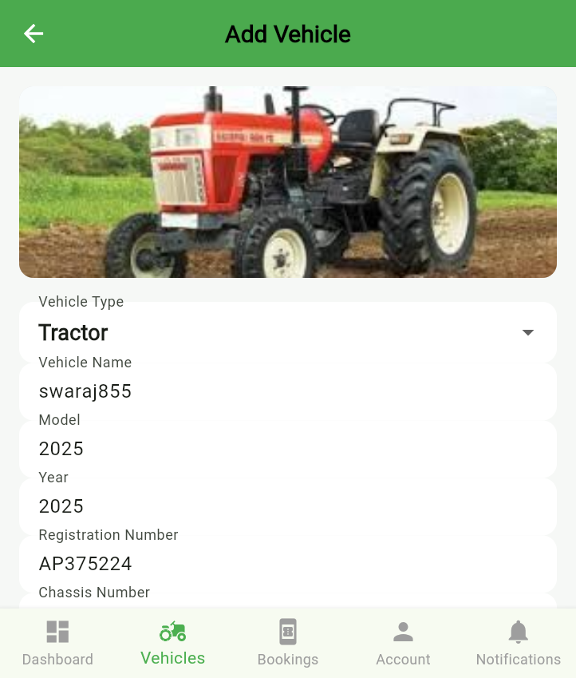
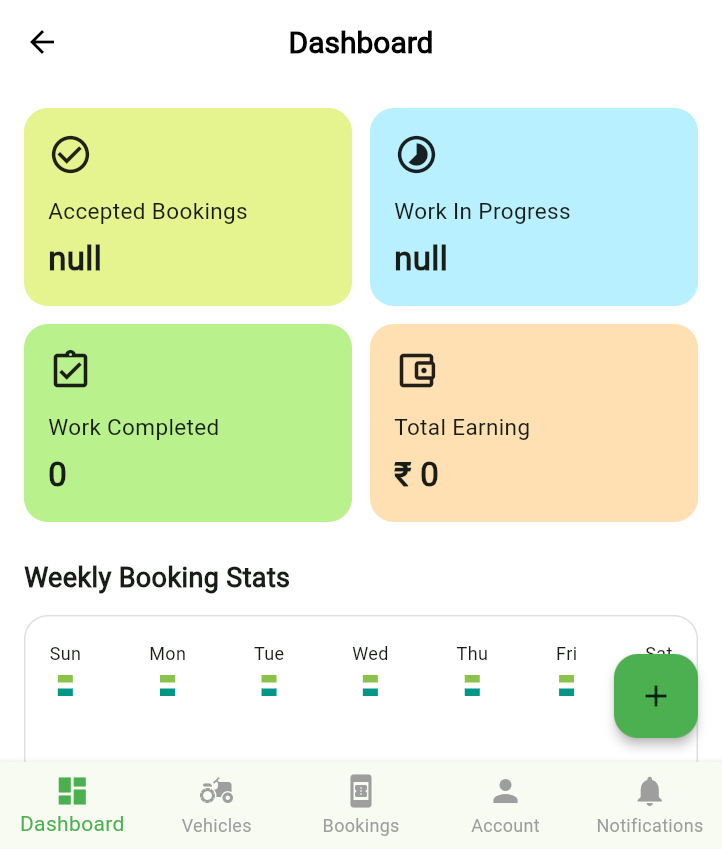
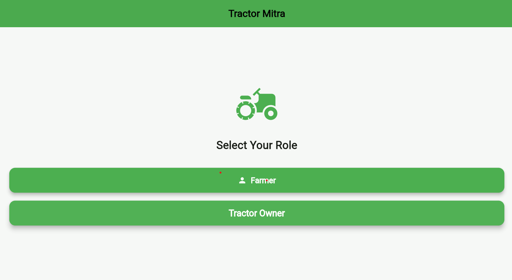

# Tractor Mitra 🚜

Tractor Mitra is a farmer-focused application built with Flutter that connects farmers with tractor owners for easy and reliable tractor booking. The platform simplifies tractor management, booking, and reviews while supporting modern digital agriculture workflows in India.

---

## 🌟 Features

- 👨‍🌾 **Farmer Dashboard** – Browse and book available tractors
- 🏭 **Owner Dashboard** – Add tractors and manage bookings
- ⭐ **Reviews & Ratings** – Rate and review tractors
- 📸 **Image Upload** – Upload tractor images
- 💳 **Payment Integration** – Razorpay integration ready
- 🌐 **Multi-platform Support** – Android, iOS, and Web
- 🚀 **Pure Dart Backend** – No Python or Django required

---

## 🏗️ Project Structure

.....
tractor_mitra/
├── lib/ # Flutter application source
│ ├── screens/ # UI screens
│ ├── services/ # API & networking
│ ├── widgets/ # Reusable widgets
│ ├── models/ # App data models
│ └── backend/ # Pure Dart backend server
│ ├── models/ # Backend models
│ ├── database/ # SQLite database service
│ ├── handlers/ # API handlers
│ └── server.dart # Server configuration
├── bin/ # Backend startup scripts
├── assets/ # Images and static assets
└── tractor_backend/ # Django backend (legacy / optional)


---

## ⚙️ Setup Instructions

### 🔹 Backend Setup (Pure Dart)

The backend is written entirely in **Dart**, making the project lightweight and easy to maintain.

1. Install dependencies:
   ```bash
   flutter pub get

# Option 1
dart run bin/start_backend.dart

# Option 2
dart lib/backend/main_server.dart

http://127.0.0.1:8000/api/

🔹 Flutter App Setup

Get dependencies:

flutter pub get


Run the app:

# Web
flutter run -d chrome

# Android / iOS
flutter run

🔌 Backend API Endpoints

GET /api/tractors/ – List available tractors

POST /api/tractors/add/ – Add a new tractor

GET /api/bookings/ – View bookings

POST /api/bookings/ – Create booking

POST /api/bookings/complete/<id>/ – Complete booking

GET /api/reviews/<tractor_id>/ – Fetch reviews

POST /api/reviews/add/ – Add review

✅ Why Pure Dart Backend?

Single language (Dart) for frontend & backend

No Python or Django dependency

Fast startup & lightweight

Type-safe data handling

Easy deployment and maintenance

🗄️ Database & Storage

Database: SQLite (auto-created on startup)

Image Storage: Local file system

🧰 Requirements

Flutter SDK 3.10.4+

Dart SDK 3.10.4+

📄 Documentation

For detailed backend documentation, see:
👉 README_BACKEND_DART.md

🤝 Contribution

Contributions, suggestions, and improvements are welcome.
Feel free to fork the repository and submit a pull request.

📜 License

This project is licensed under the MIT License.


---

### ✅ NEXT STEPS (Recommended)
- Add **screenshots** section
- Clean `.gitignore` (remove media & DB)
- Add **GitHub repo description** (short one)
- Prepare for **resume / portfolio**

If you want, I can also:
- Write a **short GitHub description**
- Add **badges** (Flutter, Dart, License)
- Review your repo like a recruiter would 🚀

## 📸 Screenshots

### 👨‍🌾 Farmer Module





### 🏭 Owner Module




### 📱 Common Screens

